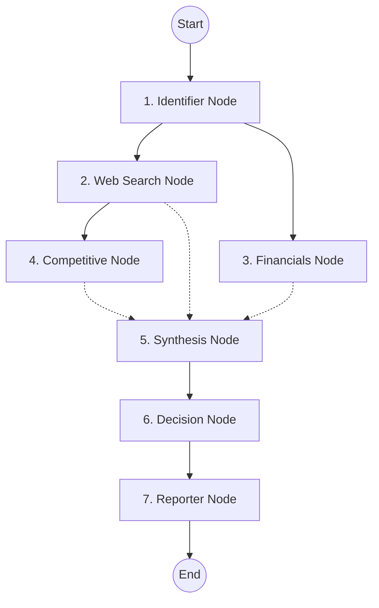

# System Architecture

Meridian uses a directed acyclic graph (DAG) architecture via **LangGraph** to orchestrate seven specialized LLM agents. This approach provides strict type safety, predictable execution order, and maximizes performance via parallel fan-out execution.

## The LangGraph Pipeline

The core logic resides in `src/lib/graph.ts`. The pipeline executes in the following sequence:



### 1. Identifier Node
**Goal:** Entity resolution and categorization.
- Takes the raw user input (e.g. "nvidia" or "open ai").
- Uses Llama-3.3-70B to resolve the canonical company name, ticker symbol, sector, and public/private status.
- **Output:** `CompanyInfo`

### 2. Web Search Node (Parallel Branch A)
**Goal:** Real-time web intelligence.
- Generates 3 contextual search queries based on the company name.
- Queries the **Tavily API** for recent news and general web results.
- Synthesizes findings into key developments, sentiment, and red flags.
- **Output:** `WebAnalysis`

### 3. Financials Node (Parallel Branch B)
**Goal:** Quantitative financial extraction.
- **For public companies:** Queries the **Alpha Vantage OVERVIEW API** using the resolved ticker.
- **For private companies:** Instructs the LLM to estimate metrics based on industry benchmarks.
- Evaluates financial health (1-10) and valuation risk.
- **Output:** `FinancialAnalysis`

### 4. Competitive Node
**Goal:** Moat and market positioning.
- Runs sequentially *after* Web Search to leverage real-time context.
- Identifies main competitors, moat type (e.g., Network Effects, Brand, Cost Advantage), and moat strength.
- **Output:** `CompetitiveAnalysis`

### 5. Synthesis Node (Fan-in)
**Goal:** Weighted scoring aggregation.
- Waits for both parallel branches (WebSearch + Competitive, and Financials) to complete.
- Analyzes all gathered data contextually.
- Outputs scores (1-10) across 5 dimensions: Growth, Moat, Financial Health, Sentiment, Valuation.
- Calculates the `weightedTotal` score.
- **Output:** `DimensionScores`, `SynthesisRationales`

### 6. Decision Node
**Goal:** Final investment committee verdict.
- Applies strict threshold rules to the `weightedTotal`:
  - `>= 7.0` = **INVEST**
  - `5.5 - 6.9` = **WATCH**
  - `< 5.5` = **PASS**
- Outputs a punchy headline, an investment thesis, and key events to "watch for".
- **Output:** `verdict`, `confidence`, `timeHorizon`

### 7. Reporter Node
**Goal:** Formatting and compilation.
- Takes the entire accumulated state and generates a highly formatted Markdown brief for the frontend UI to render.
- **Output:** `report`

---

## State Management

The `GraphState` (defined in `src/lib/state.ts`) uses the `@langchain/langgraph` `Annotation` API.

Because nodes run in parallel, state reducers are critical to avoid race conditions when writing to the state object. We use object spread reducers for nested objects:

```typescript
export const GraphState = Annotation.Root({
  companyInfo: Annotation<CompanyInfo>({
    reducer: (curr, update) => ({ ...curr, ...update }),
    default: () => ({}),
  }),
  // ... other fields
});
```

## Infrastructure: SSE Streaming API

Because Vercel Serverless Functions have timeout limits and the graph can take up to 45 seconds to complete, we do not wait for the graph to finish before returning an HTTP response.

Instead, the Next.js App Router API route (`src/app/api/research/route.ts`) returns a `ReadableStream`.

1. The API route initiates `investmentGraph.stream()`.
2. As each node finishes, the API pushes an SSE event (`data: {...}\n\n`) to the client.
3. The client (`ResearchUI.tsx`) parses the chunk and updates the Live Terminal and pipeline sidebar UI immediately.
4. When `parsed.type === 'result'`, the client autosaves the complete payload to Supabase Postgres.
